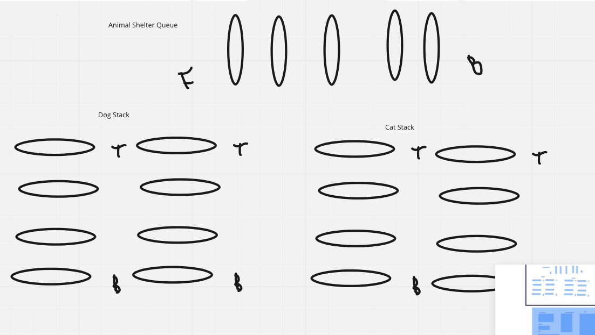

## Animal Shelter
- Create a class called AnimalShelter which holds only dogs and cats.
- The shelter operates using a first-in, first-out approach.
- Implement the following methods:

1. enqueue

Arguments: animal

animal can be either a dog or a cat object.
2. dequeue

Arguments: pref

pref can be either "dog" or "cat"

Return: either a dog or a cat, based on preference.

If pref is not "dog" or "cat" then return null.
## Whiteboard Process
## Approach & Efficiency
Having One Queue dedicated to both types of animals, create a class animal that processes a cat in one stack or a dog into a seperate stack, then create an enqueue function that pops from either stack and puts it into the queue.
